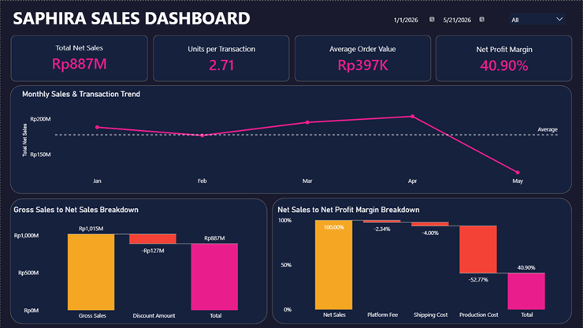

# SAPHIRA Sales Dashboard

Analisis penjualan beauty marketplace fiktif (SAPHIRA) yang menjual lewat TikTok Shop, Shopee, Website, dan Offline Store. Project ini mencakup data cleaning, data modeling, dan dashboard Power BI dengan fokus utama pada business insight, bukan sekadar visualisasi.

## Demo

[](assets/demo.mp4)

Klik gambar di atas untuk menonton video demo navigasi dashboard.

## Ringkasan Project

- **Periode data:** 1 Januari 2026 sampai 21 Mei 2026
- **Total Net Sales:** Rp887 juta dari 2.480 transaksi
- **Insight utama:** TikTok Shop punya net sales tertinggi kedua tapi margin terendah karena production cost dari barang retur, Bronze tier penyumbang revenue terbesar lewat volume, dan Wrong Shade/Changed Mind adalah dua alasan retur terbesar yang bisa diperbaiki lewat informasi produk.
- Detail lengkap insight dan rekomendasi ada di [Business Insight Notes](insight_notes/Business_Insight_Notes.md).

## Tech Stack

- **Python** (pandas, matplotlib, seaborn) untuk data understanding dan data cleaning
- **Power BI** (Power Query, DAX) untuk data modeling dan dashboard

## Struktur Folder

```
saphira-sales-dashboard/
├── assets/
│   ├── thumbnail.png
│   └── demo.mp4
├── dashboard/
│   └── SAPHIRA_Dashboard.pbix
├── data/
│   ├── raw/
│   │   ├── product_code.csv
│   │   └── transactions.csv
│   └── clean/
│       ├── product_clean.csv
│       └── transactions_clean.csv
├── python/
│   └── data_cleaning.py
├── insight_notes/
│   └── Business_Insight_Notes.md
└── README.md
```

## Metodologi Singkat

**1. Data Understanding & Cleaning (Python)**
Eksplorasi awal mencakup pengecekan shape, struktur kolom, statistik deskriptif, duplikat, missing value, outlier, dan konsistensi data, serta validasi business rule (cross check gross_sales dan net_sales). Missing value di kolom `return_reason` ditangani berdasarkan kondisi `returned_flag`, dan kolom tanggal/waktu distandarisasi ke format datetime.

**2. Data Modeling (Power BI)**
Data hasil cleaning dimodelkan dengan star schema (`dim_product` dan `dim_date` terhubung ke `fact_transactions`), lalu dibangun calculated measure dengan DAX untuk metrik seperti Net Sales, Net Profit Margin, dan Production Cost.

**3. Dashboard (Power BI)**
5 halaman dashboard dengan tema dark navy/pink: Overview, Marketplace Performance, Product Performance, Customer Insight, dan Operational Insight.

Detail lengkap proses cleaning dan logika perhitungan ada di [Business Insight Notes](insight_notes/Business_Insight_Notes.md) bagian Metodologi.

## Cara Menjalankan

1. Clone repo ini
2. Buka `dashboard/dashboard.pbix` dengan Power BI Desktop untuk eksplorasi dashboard secara langsung
3. Script cleaning data ada di `python/data_cleaning.ipynb`, jalankan dengan dataset mentah di `data/raw/`

## Kontak

Muh. Azmin
[LinkedIn](https://linkedin.com/in/muh-azmin-1b348a219) | [GitHub](https://github.com/azminlabs) | azminmuh@gmail.com
